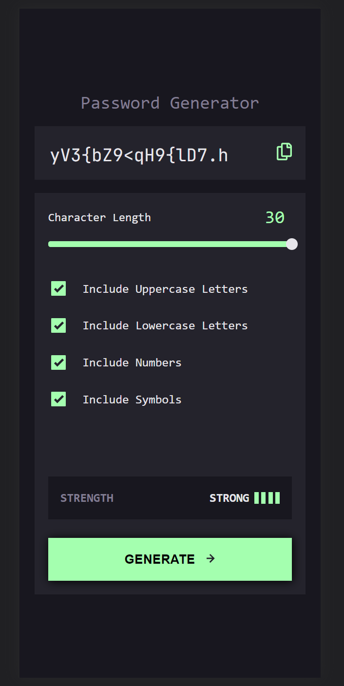
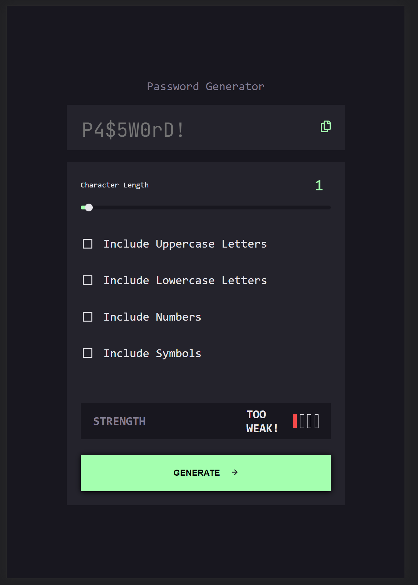
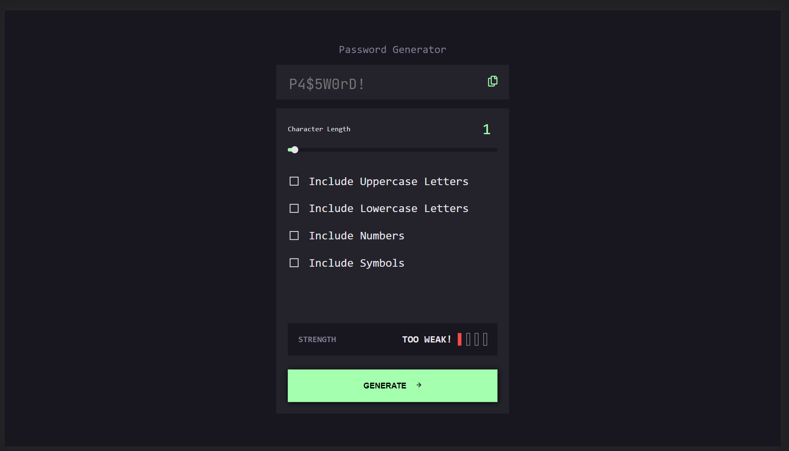
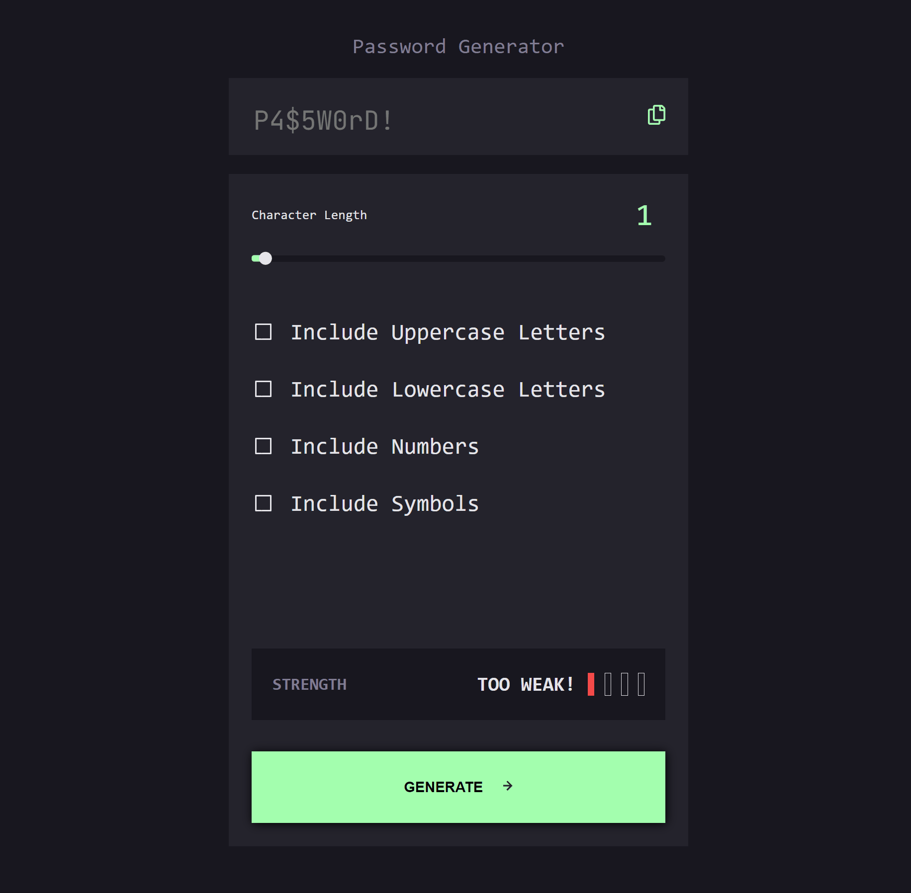

# Frontend Mentor - Password generator app solution

This is a solution to the [Password generator app challenge on Frontend Mentor](https://www.frontendmentor.io/challenges/password-generator-app-Mr8CLycqjh). Frontend Mentor challenges help you improve your coding skills by building realistic projects. 

## Table of contents

- [Overview](#overview)
  - [The challenge](#the-challenge)
  - [Screenshot](#screenshot)
  - [Links](#links)
- [My process](#my-process)
  - [Built with](#built-with)
  - [What I learned](#what-i-learned)
  - [Continued development](#continued-development)
  - [Useful resources](#useful-resources)
- [Author](#author)
- [Acknowledgments](#acknowledgments)

**Note: Delete this note and update the table of contents based on what sections you keep.**

## Overview

### The challenge

Users should be able to:

- Generate a password based on the selected inclusion options
- Copy the generated password to the computer's clipboard
- See a strength rating for their generated password
- View the optimal layout for the interface depending on their device's screen size
- See hover and focus states for all interactive elements on the page

### Screenshot







### Links

- Solution URL: [Solution](https://www.frontendmentor.io/solutions/responsive-password-generator-with-legit-strength-monitor-L_sszuQSBQ)
- Live Site URL: [Live Site](https://urealaden.github.io/password-maker/)

## My process

### Built with

- CSS custom properties
- Flexbox
- Mobile-first workflow
- [React](https://reactjs.org/) - JS library
- [Styled Components](https://styled-components.com/) - For styles
- [zxcvbn Password Strength Estimation](https://github.com/dropbox/zxcvbn)


### What I learned

This was a fun project. I can see a noticeable change with using the mobile first workflow. With every view, I find myself getting more into the habit of cross checking my changes with tablet and desktop before moving on. Oddly enough styling the slider and checkboxes proved the most painful. I didn't want to guess at what it took to measure a passwords strength so I decided to go with zxcvbn which was perfect for my needs and a recognized measure throughout the community.

```css
copyToastIn: {
   ...
    opacity: 1,
    transition: "opacity 250ms ease",
  },
  copyToastOut: {
    opacity: 0,
    transition: "opacity 250ms ease",
   ...
  },
```
```js
const generatePassword = () => {
    let password = "";
    let variationsCount = [
      context.hasLowercase,
      context.hasUppercase,
      context.hasNumbers,
      context.hasSymbols,
    ].length;
    for (let i = 0; i < context.passwordLength; i += variationsCount) {
      if (context.hasLowercase) {
        password += getRandomLower();
      }
      if (context.hasUppercase) {
        password += getRandomUpper();
      }
      if (context.hasNumbers) {
        password += getRandomNumber();
      }
      if (context.hasSymbols) {
        password += getRandomSymbol();
      }
    }
    const generatedPassword =password.slice(0,context.passwordLength); 
    context.generatePassword(generatedPassword);      
  };
  const getRandomLower = () =>
    String.fromCharCode(Math.floor(Math.random() * 26) + 97);
  const getRandomUpper = () =>
    String.fromCharCode(Math.floor(Math.random() * 26) + 65);
  const getRandomNumber = () =>
    String.fromCharCode(Math.floor(Math.random() * 10) + 48);
  const getRandomSymbol = () => {
    const symbols = "!@#$%^&*(){}[]=<>/,.";
    return symbols[Math.floor(Math.random() * symbols.length)];
  };
```

### Continued development

There's still quite a bit I don't understand. For example, I was having a fair amount of difficulty styling the input slider and checkboxes.

### Useful resources

- [Fade in-out text in React](https://levelup.gitconnected.com/fade-in-out-text-in-react-fa8fc7a2a0b1) - Hiding and rendering the COPIED notifications wasn't that great of an experience so used this article to help put together a nice fade in and out effect.
- [Auto Animate](https://auto-animate.formkit.com/#examples) - Although I ended up not going with this, I think its still a really good plugin for other projects.

## Author

- Website - [Leaundrae Mckinney](https://www.your-site.com)
- Frontend Mentor - [@urealaden](https://www.frontendmentor.io/profile/UreaLaden)